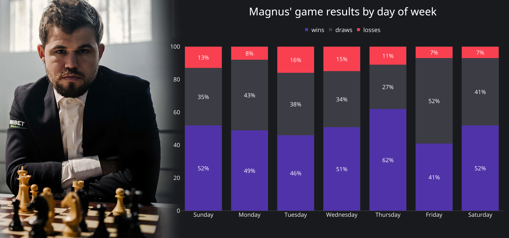

# magnus
A multi-level pie chart visualisation of the first 5 moves in the games of Magnus Carlsen after he became the world champion with white and black chess pieces separatly. 
Update: Magnus' game results proportions by day of week.

I'm a beginner in python so some code is ugly and i don't know how to make it better for now. If you have any advice, text me. Thank you. x)

### Results:
[Interactive plot is here](https://chart-studio.plotly.com/~Musatov/1.embed)

### Game results proportions by day of week

